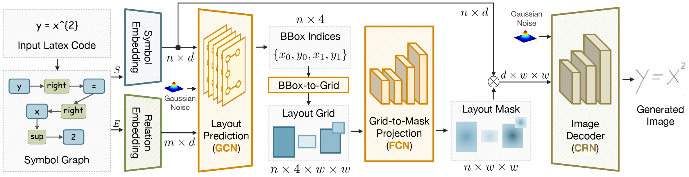

# HMEG

> Fei Gao\*, Yu Chen\*, Yanguang Zhang, Maoying Qiao, Nannan Wang\*\*. Generating Handwritten Mathematical Expressions From Symbol Graphs: An End-to-End Pipeline. Proceedings of the IEEE/CVF Conference on Computer Vision and Pattern Recognition (CVPR), accepted, Seattle WA, USA, June 17-21, 2024.
> 
> \* Equal Contributions.
> 
> \*\* Corresponding Author.

## Abstract
<p align="justify">
In this paper, we explore a novel challenging generation task, i.e. Handwritten Mathematical Expression Generation (HMEG) from symbolic sequences. Since symbolic sequences are naturally graph-structured data, we formulate HMEG as agraph-to-image (G2I) generation problem. Unlike the generation of natural images, HMEG requires critic layout clarity for synthesizing correct and recognizable formulas, but has no real masks available to supervise the learning process. To alleviate this challenge, we propose a novel end-to-end G2I generation pipeline (i.e. graph → layout → mask → image), which requires no real masks or nondifferentiable alignment between layouts and masks. Technically, to boost the capacity of predicting detailed relations among adjacent symbols, we propose a Less-is-More (LiM) learning strategy. In addition, we design a differentiable layout refinement module, which maps bounding boxes to pixel-level soft masks, so as to further alleviate ambiguous layout areas. Our whole model, including layout prediction, mask refinement, and image generation, can be jointly optimized in an end-to-end manner. Experimental results show that, our model can generate highq quality HME images, and outperforms previous generative methods. Besides, a series of ablations study demonstrate effectiveness of the proposed techniques. Finally, we validate that our generated images promisingly boosts the performance of HME recognition models, through data augmentation. 
</p>

## Pipeline

<p align="center"></p>

## Datasets and Weights

Download the CROHME 2019 dataset from [Google Drive](https://drive.google.com/drive/folders/1lTsny6ZpaCpw8N7xfScbSqiOGpjt1JGY?usp=drive_link) and put it in ```datasets/```.

All pre-trained weights are also in the Google Cloud link above.

## About Training
You need to change the training data path at line 96 of script ```train_image_generator.py```
```
python train_image_generator.py
```

## About test on method CAN
We released the test code of CAN, please click [CAN](./CAN-test-code/test.md) to test.

```bib
@inproceedings{gao2024hmeg,
title={Generating Handwritten Mathematical Expressions From Symbol Graphs: An End-to-End Pipeline},
author={Fei Gao, Yu Chen, Yanguang Zhang, Maoying Qiao, Nannan Wang},
booktitle={Conference on Computer Vision and Pattern Recognition 2024},
year={2024},
url={https://openreview.net/forum?id=8r3rs0Mub6}
}
```
